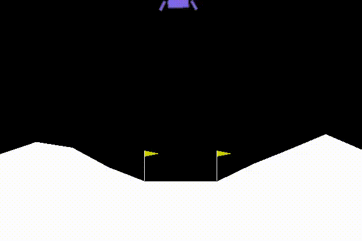
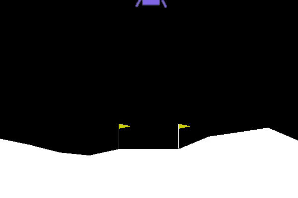

# LearningFromHumanPreferences

This is an implementation of the OpenAI - Learning from human preferences paper: 
https://arxiv.org/pdf/1706.03741.pdf 
Learning from human preferences is a method allowing reward based learning systems like reinforcement learning to master a task - in this case in the OpenAI gym - solely based on the preferred episode out of two possibilities chosen by a human observer. The observer only has to "prefer" a small subset of episodes being trained on.

# Examples
In this implementation there are two modes, the described human chooses preference mode (ask_human) and a automated preference choosing mode where the preference is always given to the episode with the higher total reward given by the environment (ask_total_reward). But note that neither the reward estimator or the agent ever get to observe the environments reward.
 
 

 
<i>Trained for 300 episodes, 150bits of preferences where given, trained on ask_total_reward so the preference was automatically given to the episode with the higher total reward provided by the environment.</i>
 
 
 
<i>Trained for 225 episodes, 225bits of preferences where given, trained by a human.</i>
 
# Structure
The whole model consists of two parts, the agent and the reward estimator. The agent is a standard q-learning rl agent, acting in an OpenAI gym environment. The reward estimator is a neural network, that when given a certain state learns to assign a reward. It does so by employing a loss that is based on the human preference between two examples. During training, the agent is trained on the reward from the reward estimator and the reward estimator is trained on the preferences being given by a human in parallel to the agent's training. The reward estimator is also an ensemble of neural networks, the reward on which the agent trains is the normalized average of all the rewards. (Some parts are different in this implementation, but i will try to add them)
